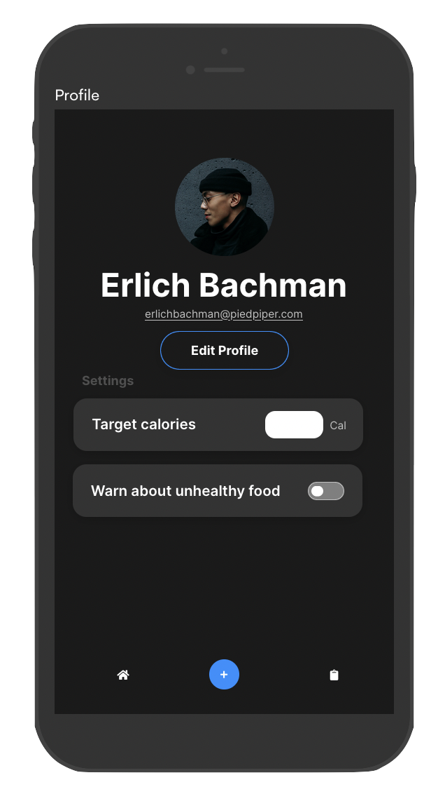
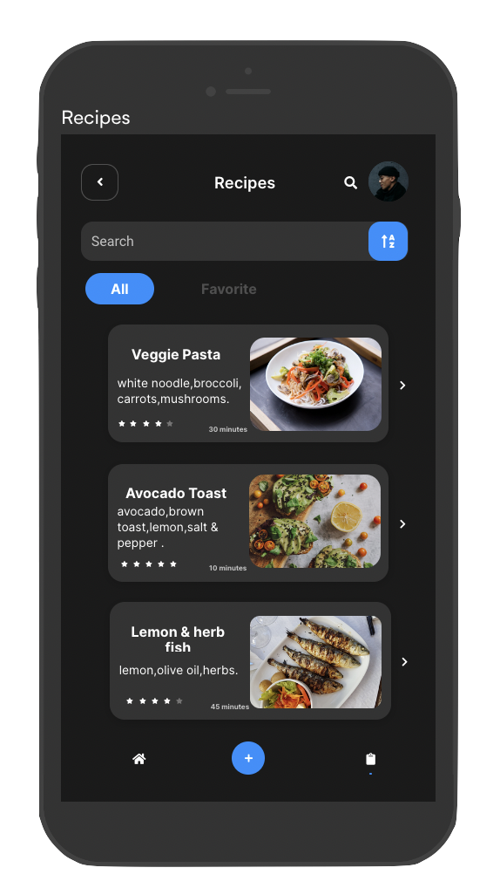
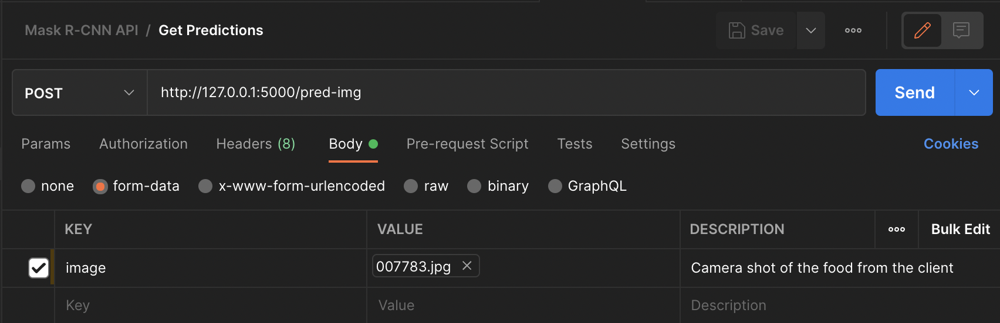

# Nutrimeter

---
## Design Prototype
1. Sign-up page 1  

2. Sign-up page 2  

3. Sign-up page 3  

4. Home page  

5. Profile and settings  

6. Recipes page  

7. Camera page  

---
## Mask R-CNN service
* build docker image from the `Dockerfile` located `Docker/ai/prod` or `Docker/ai/dev` __prod__ for production and __dev__ for devlopment and testing.  
#### Note:
When running the development image make sure to use bind mounting.

When deploying make sure the image has a copy of the source code.

In both cases you need to expose a port, 5000 being the default flask API port

---
### Testing Mask R-CNN
Once the container is up and running on port 5000 for example

1. open any http client like `Postman` or `CURL` or anyother http client
2. In the body section of the request select `form-data`
3. Give the key as image of type file and select the image in your local system
4. Make a HTTP POST request to the following endpoint `http://127.0.0.1:5000/pred-img`

5. Mask R-CNN will generate an image in the mounted volume
